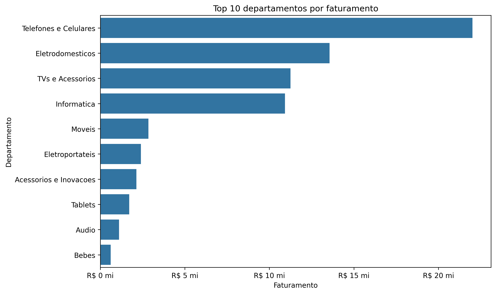
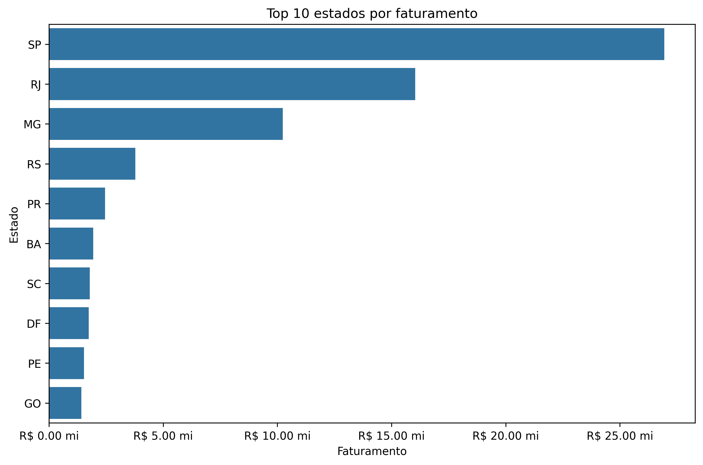
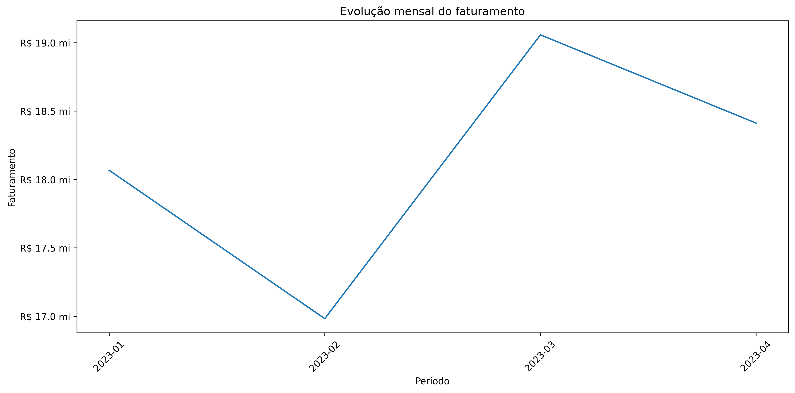
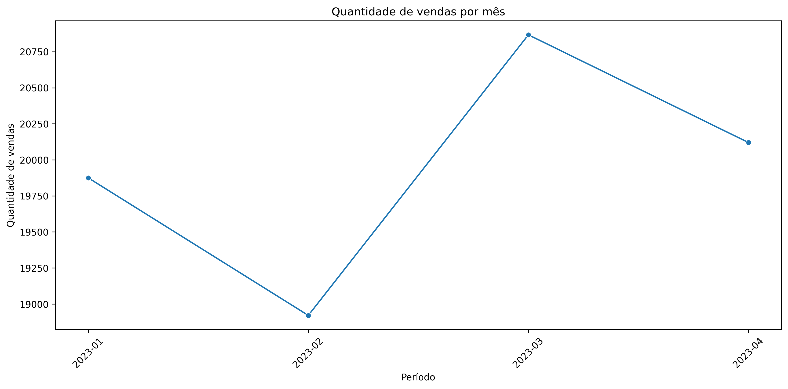
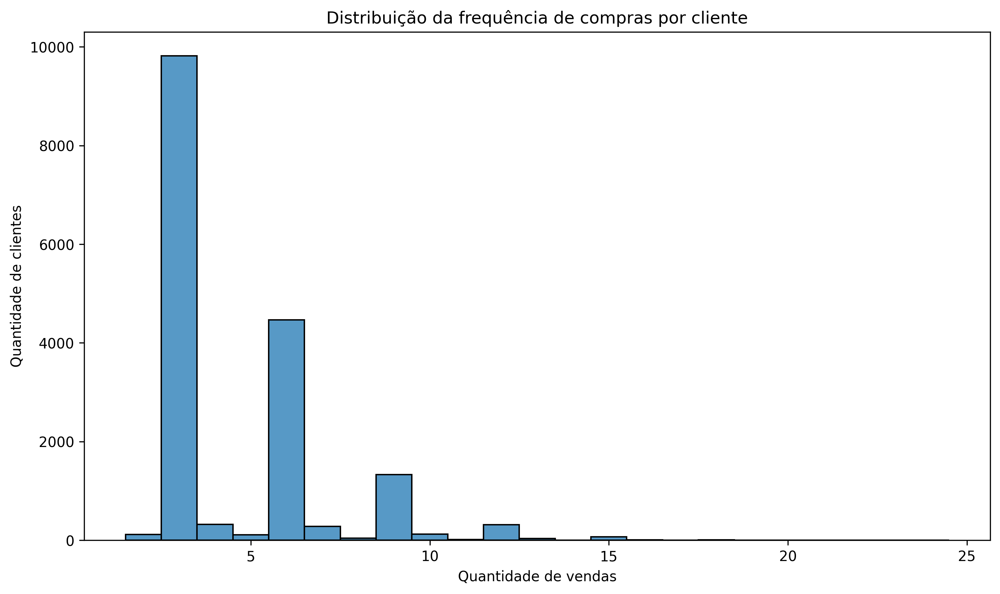

# Retail Sales & Customer Analytics

Projeto de **Análise de Dados aplicada ao varejo**, desenvolvido com Python para explorar o desempenho comercial, compreender o comportamento dos clientes e transformar dados de vendas em insights relevantes para tomada de decisão.

O projeto contempla desde a **validação e tratamento dos dados** até a construção de KPIs, análises comerciais, segmentação de clientes e recomendações de negócio.

---

## 📌 Visão geral

A análise foi desenvolvida a partir da integração de duas bases:

- dados de vendas;
- dados cadastrais de clientes.

Durante o projeto foram analisados aspectos como faturamento, departamentos, canais de venda, localização geográfica, evolução temporal, perfil dos clientes, frequência de compras e concentração de receita.

Além da análise exploratória, foram realizadas validações de qualidade e granularidade dos dados antes da construção dos indicadores.

---

## 🎯 Objetivo

O principal objetivo deste projeto é transformar dados brutos de vendas e clientes em informações capazes de apoiar decisões comerciais.

Entre as perguntas investigadas estão:

- Qual é o faturamento total da operação?
- Quantas vendas foram realizadas?
- Qual é o valor médio por venda?
- Quais departamentos concentram maior faturamento?
- Quais estados possuem maior participação comercial?
- Como o faturamento evolui ao longo do tempo?
- Qual é o perfil dos clientes?
- Idade ou renda apresentam relação com o faturamento?
- Quais clientes possuem maior valor para o negócio?
- Qual é a importância da frequência de compras?
- Quanto da receita está concentrada nos clientes de maior valor?

---

## 📊 Principais indicadores

| Indicador                                             |            Resultado |
| ----------------------------------------------------- | -------------------: |
| Faturamento total                                     | **R$ 72,52 milhões** |
| Quantidade de vendas                                  |           **79.783** |
| Valor médio por venda                                 |        **R$ 908,94** |
| Clientes únicos                                       |           **17.074** |
| Clientes estratégicos                                 |            **3.577** |
| Participação dos clientes estratégicos na base        |           **20,95%** |
| Participação dos clientes estratégicos no faturamento |           **44,11%** |
| Participação do Top 10% dos clientes no faturamento   |           **26,70%** |

---

## 🔎 Principais insights

### Concentração por departamento

Os departamentos de:

- Telefones e Celulares;
- Eletrodomésticos;
- TVs e Acessórios;
- Informática;

concentram aproximadamente **80% do faturamento total**.

Esse resultado demonstra a importância comercial dessas categorias para o desempenho da operação.

---

### Importância da frequência de compras

A análise mostrou que os clientes classificados no grupo de **alta frequência** são responsáveis por aproximadamente **60,85% do faturamento total**.

O valor médio por venda apresenta variação relativamente menor entre os grupos de frequência.

Isso sugere que a diferença de faturamento entre os segmentos está fortemente associada à **recorrência de compras**.

---

### Clientes estratégicos

Foram identificados **3.577 clientes estratégicos**, definidos como consumidores que apresentam simultaneamente:

- faturamento igual ou superior ao terceiro quartil;
- frequência de compras igual ou superior ao terceiro quartil.

Esse grupo representa apenas **20,95% da base**, porém é responsável por aproximadamente **44,11% do faturamento total**.

---

### Concentração de receita

Os **10% de clientes com maior faturamento acumulado** são responsáveis por aproximadamente **26,70% da receita total**.

O resultado demonstra uma concentração relevante de receita entre consumidores de maior valor, embora o faturamento não esteja dependente exclusivamente de uma parcela extremamente pequena da base.

---

### Perfil demográfico

As correlações encontradas foram aproximadamente:

- renda × faturamento: **0,003**;
- idade × faturamento: **-0,002**.

Os valores próximos de zero indicam baixa relação linear entre essas características demográficas e o faturamento individual.

Nesse conjunto de dados, variáveis comportamentais, como **frequência e histórico de compras**, mostraram-se mais úteis para compreender o valor dos clientes.

---

## 📈 Visualizações

### Top 10 departamentos por faturamento



---

### Top 10 estados por faturamento



---

### Evolução mensal do faturamento



---

### Quantidade de vendas por mês



---

### Distribuição da frequência de compras



---

## 🧹 Tratamento e qualidade dos dados

Antes da construção dos indicadores, foram realizadas diferentes validações para garantir consistência nas análises.

### Valores ausentes

Foram encontrados **302 registros** com valores ausentes simultaneamente nas variáveis de preço e estado.

Esses registros correspondiam a aproximadamente **0,38% da base de vendas**.

Como não foi encontrada uma estratégia confiável para recuperação dessas informações, os registros foram removidos.

---

### Validação de preço e frete

Também foi analisada a relação entre:

- `Preço`;
- `Preço_com_frete`.

Foram identificados **143 registros** nos quais:

`Preço > Preço_com_frete`

Como não havia evidência suficiente para corrigir esses valores de maneira confiável, esses registros foram removidos.

Posteriormente, foi criada a variável:

`Frete = Preço_com_frete - Preço`

---

## 👥 Consolidação da base de clientes

A base original apresentava múltiplos registros associados ao mesmo `cliente_Log`.

Uma junção direta entre vendas e clientes aumentava artificialmente a quantidade de registros da base, indicando uma relação inadequada para análise.

Para resolver o problema, cada cliente foi consolidado em um único registro utilizando:

- mediana da idade;
- mediana da renda.

A base consolidada passou a possuir **17.074 clientes únicos**.

A integração final foi validada utilizando uma relação `many_to_one`, preservando a quantidade original de vendas.

---

## 🔬 Validação da granularidade

Uma etapa importante do projeto foi investigar o campo `idcompra`.

A análise mostrou que esse identificador pode aparecer associado a diferentes clientes e datas.

Por esse motivo, `idcompra` não foi considerado uma chave única de pedido.

Ao analisar a combinação:

`idcompra + cliente_Log + Data`

foram encontradas **79.783 combinações únicas**, exatamente a mesma quantidade de registros existentes na base tratada.

Dessa forma, cada registro passou a ser considerado uma **venda individual**.

Essa decisão evita agregações artificiais e garante maior consistência nos indicadores finais.

---

## 👤 Segmentação de clientes

Os clientes foram analisados considerando métricas comportamentais como:

- quantidade de vendas;
- faturamento acumulado;
- valor médio por venda;
- frequência de compras.

Uma primeira segmentação foi construída utilizando quartis do faturamento acumulado:

- Baixo valor;
- Médio-baixo valor;
- Médio-alto valor;
- Alto valor.

Os clientes classificados como **Alto valor** apresentaram simultaneamente maior faturamento médio e maior frequência de compras.

---

## 🔁 Segmentação por frequência

Como todos os clientes da base analisada apresentavam pelo menos duas vendas, a classificação tradicional entre cliente recorrente e não recorrente não seria suficientemente informativa.

Por isso, foram criados níveis relativos de frequência utilizando a própria distribuição dos dados.

Os grupos utilizados foram:

- **Baixa frequência**;
- **Média frequência**;
- **Alta frequência**.

Os clientes de alta frequência apresentaram participação de aproximadamente **60,85% no faturamento total**, reforçando a importância da recorrência para geração de receita.

---

## 💡 Recomendações de negócio

A partir dos resultados encontrados, algumas oportunidades comerciais foram identificadas.

### 1. Priorizar clientes estratégicos

Clientes estratégicos representam aproximadamente **20,95% da base**, mas geram **44,11% do faturamento**.

Ações de retenção, relacionamento e fidelização podem ser especialmente relevantes para esse grupo.

### 2. Estimular a frequência de compras

A recorrência mostrou forte relevância financeira.

Campanhas de recompra, programas de fidelidade e estratégias de cross-sell podem ajudar a aumentar a frequência dos clientes de menor recorrência.

### 3. Proteger categorias de maior faturamento

As quatro principais categorias concentram aproximadamente **80% do faturamento**.

Monitoramento de estoque, demanda e disponibilidade desses produtos pode ser estratégico para preservar o desempenho da operação.

### 4. Desenvolver estratégias regionais

Os estados de maior faturamento apresentam oportunidades para estratégias comerciais e logísticas específicas.

Também é possível investigar regiões de menor participação em busca de oportunidades de crescimento.

### 5. Investigar o desempenho de março

Março apresentou o melhor desempenho dentro do período analisado.

Campanhas, sazonalidade, disponibilidade de estoque, alterações de preço e ações promocionais devem ser investigadas para identificar fatores que possam explicar esse resultado.

### 6. Priorizar segmentações comportamentais

Idade e renda apresentaram baixa relação linear com o faturamento.

Para campanhas comerciais, métricas de comportamento de compra podem ser mais úteis, incluindo:

- frequência;
- faturamento acumulado;
- valor médio por venda;
- categorias adquiridas;
- histórico de compras.

---

## 🛠️ Tecnologias utilizadas

- **Python**
- **Pandas**
- **NumPy**
- **Matplotlib**
- **Seaborn**
- **Plotly**
- **Jupyter Notebook**
- **OpenPyXL**
- **Git**
- **GitHub**

---

## 📁 Estrutura do projeto

```text
retail-sales-analysis/
│
├── data/
│   ├── varejo.xlsx
│   └── cliente_varejo.xlsx
│
├── images/
│   ├── top_departamentos_faturamento.png
│   ├── top_estados_faturamento.png
│   ├── evolucao_fat_mensal.png
│   ├── vendas_mensais.png
│   └── freq_compras_clientes.png
│
├── notebooks/
│   └── retail_sales_analysis.ipynb
│
├── src/
│   └── data_processing.py
│
├── .gitignore
├── README.md
└── requirements.txt
```

---

## ⚙️ Pipeline de preparação

O arquivo:

`src/data_processing.py`

centraliza as principais etapas de preparação dos dados:

1. carregamento das bases;
2. tratamento da base de vendas;
3. consolidação da base de clientes;
4. integração entre vendas e clientes;
5. validação da estrutura final.

Para executar o pipeline:

```bash
python src/data_processing.py
```

---

## 🚀 Como executar o projeto

### 1. Clone o repositório

```bash
git clone https://github.com/Jv-ghost/retail-sales-analysis.git
```

Entre na pasta:

```bash
cd retail-sales-analysis
```

### 2. Crie um ambiente virtual

Windows:

```bash
python -m venv .venv
```

Ative:

```bash
.venv\Scripts\activate
```

### 3. Instale as dependências

```bash
pip install -r requirements.txt
```

### 4. Execute o pipeline

```bash
python src/data_processing.py
```

### 5. Abra o notebook

```text
notebooks/retail_sales_analysis.ipynb
```

O notebook contém todas as etapas de exploração, validação, análise, visualização e interpretação dos resultados.

---

## 📓 Notebook

A análise completa está disponível em:

`notebooks/retail_sales_analysis.ipynb`

O notebook segue o fluxo:

**contextualização → código → validação → interpretação**

permitindo acompanhar não apenas os resultados, mas também as decisões tomadas durante o processo analítico.

---

## ✅ Conclusão

O projeto demonstra um fluxo completo de Análise de Dados aplicado a um cenário de varejo.

A análise envolveu desde a inspeção e preparação dos dados até a criação de indicadores, análises temporais, segmentação de clientes e geração de recomendações comerciais.

Um dos principais aprendizados do projeto foi a importância da validação da **qualidade, cardinalidade e granularidade dos dados antes da construção dos KPIs**.

A investigação dessas características evitou duplicações e interpretações incorretas que poderiam comprometer os resultados.

Do ponto de vista comercial, os resultados mostram que **frequência de compra, faturamento acumulado e comportamento transacional** são especialmente relevantes para compreender o valor dos clientes e apoiar decisões orientadas por dados.

---

## 👨‍💻 Autor

**João Vitor Duarte de Oliveira**  
Análise de Dados | Cientista de Dados | Python | SQL | Power BI

Projeto desenvolvido como parte do meu portfólio profissional, com foco em preparação de dados, análise exploratória, visualização, construção de indicadores e geração de insights para negócio.

- **GitHub:** [Jv-ghost](https://github.com/Jv-ghost)
- **LinkedIn:** [João Vitor Duarte de Oliveira](https://www.linkedin.com/in/joão-vitor-duarte-de-olliveira)

---

⭐ Se este projeto foi útil ou interessante, fique à vontade para explorar o repositório.
